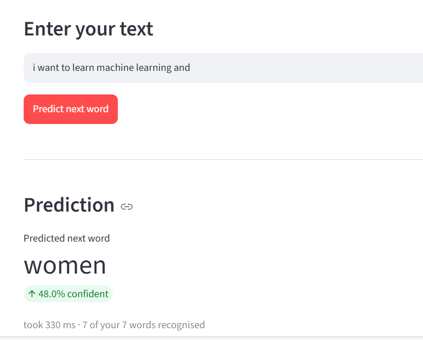

# Next Word Prediction

An LSTM-based next-word prediction model with a health dashboard that evaluates prediction quality in real-time.

## Files

| File | Description |
|------|-------------|
| `app.py` | Original Streamlit app (simple prediction) |
| `dashboard.py` | Enhanced app with prediction + health dashboard |
| `lstm_model.h5` | Trained Keras LSTM model (22 MB, 1.8M params) |
| `tokenizer.pkl` | Keras tokenizer (8,978 words) |
| `max_len.pkl` | Context window: 745 tokens |
| `requirements.txt` | Python dependencies |

## Quick Start

```bash
# Create venv (Python 3.10 recommended)
python -m venv venv
.\venv\Scripts\activate
pip install -r requirements.txt

# Run the health dashboard
streamlit run dashboard.py
```

## Dashboard Preview



## What the Health Dashboard Shows

After typing text and clicking **Predict next word**:

- **Predicted word** — large, with confidence %
- **6 health checks** for that specific prediction:
  - ✅ Understood your text (vocabulary coverage)
  - ✅ Enough context (not truncated)
  - ✅ Confident in the answer
  - ✅ Clear winner over runner-up
  - ✅ Distribution is focused (low entropy)
  - ✅ Fast enough to use

## Model Details

- **Architecture**: `Input(745) → Embedding(10000→50) → LSTM(128) → Dense(10000, softmax)`
- **Parameters**: 1,881,648
- **Vocabulary**: 8,978 words
- **Context window**: 745 tokens
- **Training framework**: Keras 2.x (loaded via HDF5 rebuild for TF 2.21 compatibility)

## Note on Model Loading

The model was saved with Keras 2.x and contains config keys (`batch_shape`, `quantization_config`) that Keras 3 / TF 2.21 reject. The dashboard reads the architecture from the HDF5, rebuilds the identical graph, and transplants weights by name.